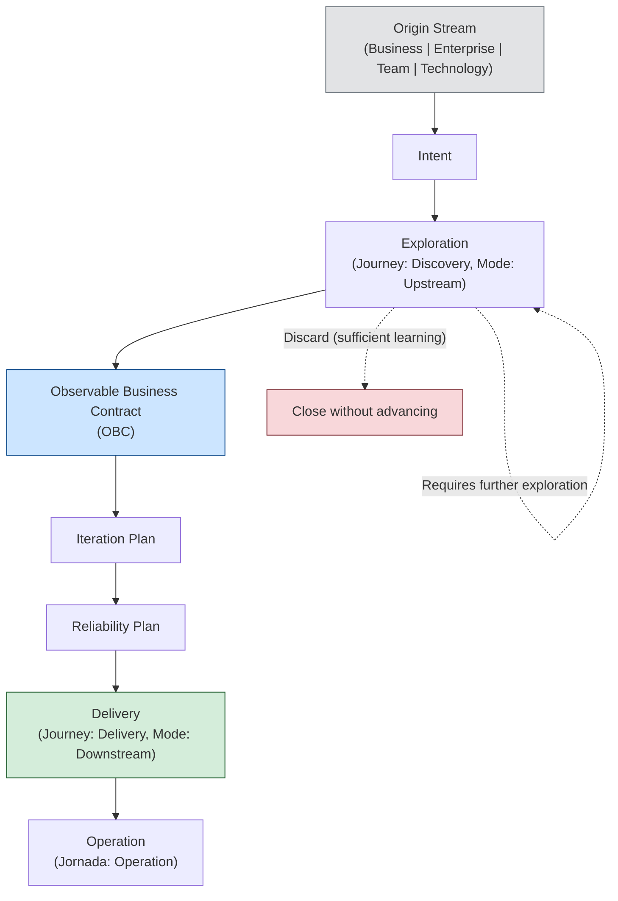

# Framework Flow

The official ProdOps Framework flow describes the path every change takes from its origin to continuous operation.

```
Origin Stream → Intent → Exploration → OBC → Iteration Plan → Reliability Plan → Delivery → Operation
```

This document is the canonical reference for understanding **what happens at each step**, **what is produced**, and **when to advance**.

→ [Origin Streams: the four possible origins](origin-streams.en.md)
→ [Operating model: Framework hierarchy](operating-model.en.md)
→ [Glossary: canonical definitions](glossary.en.md)

---

## Full diagram



---

## Flow steps

### 1. Origin Stream

**Objective:** Classify the origin of the change to establish the correct context.

**What happens:** A contributor, stakeholder, or process identifies a need. The need is classified into one of the four Origin Streams: Business, Enterprise, Team, or Technology.

**What is produced:** The raw need, not yet formalized as an Intent.

**When to advance:** As soon as the origin is clear and Intent registration can begin.

→ [Definition of each Origin Stream](origin-streams.en.md)

---

### 2. Intent

**Objective:** Formalize the need as an explicit intention, without implementation commitment.

**What happens:** The raw need is registered as an Intent. The Intent documents: the value intended to be generated, the context that motivated the need, the initial hypotheses, and the open questions. No solution is defined at this point.

**What is produced:**
- Intent document in `prodops/business-intents/<slug>.md`
- Declared Origin Stream
- Listed hypotheses and open questions
- Suggested execution mode (Upstream or Downstream)

**When to advance:** As soon as the Intent is registered and there is a decision to continue (not discard).

> The OBC is **not** the Framework entry point. It is the output of Exploration — the transformation of a sufficiently understood Intent into an observable contract.

→ [Intent template](../templates/business-intents/intent.en.md)

---

### 3. Exploration

**Objective:** Transform the Intent into validated knowledge, reducing uncertainty before any formal delivery commitment.

**What happens:** The Intent enters Upstream mode through the Discovery Journey. Hypotheses are tested through experiments, spikes, prototypes, and Event Storming. Code generated in this phase is disposable. Learning is the primary result.

**What is produced:**
- Experiment in `prodops/journeys/discovery/experiments/<NNN-slug>/`
- Decision Package (hypothesis answered, clear recommendation, learnings)
- OBC draft (candidate)
- BDD Feature draft
- Risk and opportunity updates

**When to advance:** When the central hypothesis has been answered, the expected behavior is sufficiently understood, and the remaining uncertainty is acceptable to enter Downstream. The decision to advance is explicit (PM + Tech Lead).

**When not to advance:** If the hypothesis was refuted, uncertainty is still too high, or an external business decision is missing. In these cases: record the learning and close the experiment without promoting.

→ [Discovery Journey](../journeys/discovery/README.en.md)
→ [Execution Mode Upstream](../execution-model/upstream.en.md)

---

### 4. Observable Business Contract (OBC)

**Objective:** Transform the knowledge validated by Exploration into an observable and verifiable contract.

**What happens:** The OBC draft produced in Exploration is reviewed, refined, and promoted to `prodops/artifacts/obcs/`. The OBC defines measurable success criteria that anchor all subsequent implementation. Without a committed OBC, there is no Downstream.

**What is produced:**
- OBC committed in `prodops/artifacts/obcs/<slug>.md`
- BDD Feature committed in `prodops/artifacts/bdd/<slug>.feature`

**When to advance:** OBC is in `prodops/artifacts/obcs/`, BDD Feature is in `prodops/artifacts/bdd/`, both reviewed and approved.

→ [OBC artifacts](../artifacts/obcs/)
→ [Promotion process](../journeys/discovery/README.en.md#promotion-to-downstream-process)

---

### 5. Iteration Plan

**Objective:** Formally commit the capability to the next delivery iteration.

**What happens:** The approved OBC enters the Iteration Plan with status `In`. This represents the formal delivery commitment — the item leaves the Backlog and enters the executable plan.

**What is produced:**
- Entry in the Iteration Plan in `prodops/artifacts/plans/iteration-plan.md` with status `In`
- Tracking List update if the item was there

**When to advance:** Item in the Iteration Plan with status `In`.

→ [Iteration Plan](../artifacts/plans/iteration-plan.en.md)

---

### 6. Reliability Plan

**Objective:** Define the reliability conditions that delivery must satisfy before being promoted.

**What happens:** The risks identified in Exploration are transformed into a reliability plan. SLOs, mitigation actions, rollback criteria, and failure points are explicitly documented.

**What is produced:**
- Entry in the Reliability Plan in `prodops/journeys/assessment/reliability-plans/`
- Risks updated in `prodops/journeys/assessment/risks.md`

**When to advance:** Reliability Plan updated with the risks of the item to be implemented.

→ [Reliability Plans](../journeys/assessment/reliability-plans/)

---

### 7. Delivery

**Objective:** Implement the capability with traceability, verifiable acceptance criteria, and evidence recorded at each step.

**What happens:** Downstream work follows the mandatory sequence `Bootstrap → Hack → Sync → Finish → Ship → Validate → Promote`, divided into CI Sync (local work) and CI Async (platform and pipelines).

**What is produced:**
- Delivered and promoted software
- Updated Release Trail
- Recorded evidence
- Validated OBC

**When to advance:** Promote completed, Release Trail updated, OBC validated in production.

→ [Delivery Journey](../journeys/delivery/README.en.md)
→ [Execution Mode Downstream](../execution-model/downstream.en.md)

---

### 8. Operation

**Objective:** Continuously operate and monitor the delivered software, ensuring that OBC criteria are maintained over time.

**What happens:** Runbooks, SLO monitoring, alerts, incident response, postmortems, operational trail updates. Operation feeds Continuous Assessment, which can generate new Intents.

**What is produced:**
- Updated Operational Trail
- Documented incidents
- Postmortems when relevant
- New Intents (via Continuous Assessment)

**When to advance:** Operation is continuous — it has no defined end point. The cycle restarts with new Intents generated by operational learning.

→ [Operation Journey](../journeys/operation/)

---

## Naming notes

**Exploration vs Discovery vs Upstream**

These three terms describe different aspects of the same phase of the flow:

| Term | Level | Meaning |
|---|---|---|
| **Exploration** | Flow step | What happens between Intent and OBC: uncertainty reduction |
| **Discovery** | Journey | The name of the Framework journey that implements Exploration |
| **Upstream** | Execution Mode | The execution mode (low commitment) used during Discovery |

When describing the macro flow, use **Exploration**. When referencing the specific journey, use **Discovery**. When referencing the execution mode, use **Upstream**.

---

## References

→ [Origin Streams](origin-streams.en.md)
→ [Glossary](glossary.en.md)
→ [Operating model](operating-model.en.md)
→ [Execution Model](../execution-model/README.en.md)
→ [Journeys](../journeys/README.en.md)
