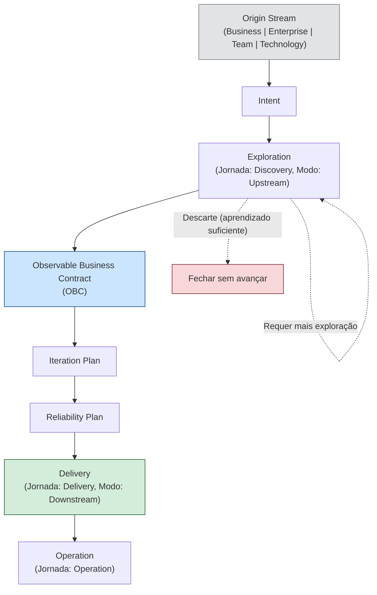

# Framework Flow

O fluxo oficial do Framework ProdOps descreve o caminho que toda mudança percorre desde a sua origem até a operação contínua.

```
Origin Stream → Intent → Exploration → OBC → Iteration Plan → Reliability Plan → Delivery → Operation
```

Este documento é a referência canônica para entender **o que acontece em cada etapa**, **o que é produzido** e **quando avançar**.

→ [Origin Streams: as quatro origens possíveis](origin-streams.md)
→ [Modelo operacional: hierarquia do Framework](operating-model.md)
→ [Glossário: definições canônicas](glossary.md)

---

## Diagrama completo



---

## Etapas do fluxo

### 1. Origin Stream

**Objetivo:** Classificar a origem da mudança para estabelecer o contexto correto.

**O que acontece:** Um colaborador, stakeholder ou processo identifica uma necessidade. A necessidade é classificada em um dos quatro Origin Streams: Business, Enterprise, Team ou Technology.

**O que é produzido:** A necessidade bruta, ainda não formalizada como Intent.

**Quando avançar:** Assim que a origem estiver clara e o registro da Intent puder ser iniciado.

→ [Definição de cada Origin Stream](origin-streams.md)

---

### 2. Intent

**Objetivo:** Formalizar a necessidade como uma intenção explícita, sem compromisso de implementação.

**O que acontece:** A necessidade bruta é registrada como Intent. A Intent documenta: o valor que se pretende gerar, o contexto que motivou a necessidade, as hipóteses iniciais e as perguntas em aberto. Não há solução definida neste momento.

**O que é produzido:**
- Documento de Intent em `prodops/business-intents/<slug>.md`
- Origin Stream declarado
- Hipóteses e perguntas em aberto listadas
- Sugestão de modo de execução (Upstream ou Downstream)

**Quando avançar:** Assim que a Intent estiver registrada e houver decisão de continuar (não descartar).

> O OBC **não** é a entrada do Framework. É a saída da Exploration — a transformação de uma Intent suficientemente compreendida em um contrato observável.

→ [Template de Intent](../templates/business-intents/intent.md)

---

### 3. Exploration

**Objetivo:** Transformar a Intent em conhecimento validado, reduzindo incerteza antes de qualquer compromisso formal de entrega.

**O que acontece:** A Intent entra no modo Upstream pela Jornada Discovery. Hipóteses são testadas por meio de experimentos, spikes, protótipos e Event Storming. Código gerado nesta fase é descartável. O aprendizado é o resultado primário.

**O que é produzido:**
- Experimento em `prodops/journeys/discovery/experiments/<NNN-slug>/`
- Decision Package (hipótese respondida, recomendação clara, aprendizados)
- OBC draft (candidato)
- BDD Feature draft
- Atualização de riscos e oportunidades

**Quando avançar:** Quando a hipótese central tiver sido respondida, o comportamento esperado estiver suficientemente compreendido e a incerteza remanescente for aceitável para entrar em Downstream. A decisão de avançar é explícita (PM + Tech Lead).

**Quando não avançar:** Se a hipótese foi refutada, a incerteza é ainda muito alta ou falta uma decisão de negócio externa. Nestes casos: registrar o aprendizado e fechar o experimento sem promover.

→ [Jornada Discovery](../journeys/discovery/README.md)
→ [Execution Mode Upstream](../execution-model/upstream.md)

---

### 4. Observable Business Contract (OBC)

**Objetivo:** Transformar o conhecimento validado pela Exploration em um contrato observável e verificável.

**O que acontece:** O OBC draft produzido na Exploration é revisado, refinado e promovido para `prodops/artifacts/obcs/`. O OBC define critérios de sucesso mensuráveis que ancoram toda a implementação subsequente. Sem OBC committed, não há Downstream.

**O que é produzido:**
- OBC committed em `prodops/artifacts/obcs/<slug>.md`
- BDD Feature committed em `prodops/artifacts/bdd/<slug>.feature`

**Quando avançar:** OBC está em `prodops/artifacts/obcs/`, BDD Feature está em `prodops/artifacts/bdd/`, ambos revisados e aprovados.

→ [Artefatos OBC](../artifacts/obcs/)
→ [Processo de promoção](../journeys/discovery/README.md#processo-de-promoção-para-downstream)

---

### 5. Iteration Plan

**Objetivo:** Comprometer formalmente a capability na próxima iteração de entrega.

**O que acontece:** O OBC approved entra no Iteration Plan com status `Entrou`. Isso representa o compromisso formal de entrega — o item sai do Backlog e entra no plano executável.

**O que é produzido:**
- Entrada no Iteration Plan em `prodops/artifacts/plans/iteration-plan.md` com status `Entrou`
- Atualização da Tracking List se o item estava lá

**Quando avançar:** Item no Iteration Plan com status `Entrou`.

→ [Iteration Plan](../artifacts/plans/iteration-plan.md)

---

### 6. Reliability Plan

**Objetivo:** Definir as condições de confiabilidade que a entrega deve satisfazer antes de ser promovida.

**O que acontece:** Os riscos identificados na Exploration são transformados em um plano de confiabilidade. SLOs, ações de mitigação, critérios de rollback e pontos de falha são documentados explicitamente.

**O que é produzido:**
- Entrada no Reliability Plan em `prodops/journeys/assessment/reliability-plans/`
- Riscos atualizados em `prodops/journeys/assessment/risks.md`

**Quando avançar:** Reliability Plan atualizado com os riscos do item a ser implementado.

→ [Reliability Plans](../journeys/assessment/reliability-plans/)

---

### 7. Delivery

**Objetivo:** Implementar a capability com rastreabilidade, critérios de aceite verificáveis e evidência registrada em cada etapa.

**O que acontece:** O trabalho Downstream segue a sequência obrigatória `Bootstrap → Hack → Sync → Finish → Ship → Validate → Promote`, dividida em CI Sync (trabalho local) e CI Async (plataforma e pipelines).

**O que é produzido:**
- Software entregue e promovido
- Release Trail atualizado
- Evidências registradas
- OBC validado

**Quando avançar:** Promote concluído, Release Trail atualizado, OBC validado em produção.

→ [Jornada Delivery](../journeys/delivery/README.md)
→ [Execution Mode Downstream](../execution-model/downstream.md)

---

### 8. Operation

**Objetivo:** Operar e monitorar continuamente o software entregue, garantindo que os critérios do OBC sejam mantidos ao longo do tempo.

**O que acontece:** Runbooks, monitoramento de SLOs, alertas, resposta a incidentes, postmortems, atualizações de operational trail. A operação alimenta o Continuous Assessment, que pode gerar novas Intents.

**O que é produzido:**
- Operational Trail atualizado
- Incidentes documentados
- Postmortems quando relevante
- Novas Intents (via Continuous Assessment)

**Quando avançar:** Operação é contínua — não tem ponto de encerramento definido. O ciclo recomeça com novas Intents geradas pelo aprendizado operacional.

→ [Jornada Operation](../journeys/operation/)

---

## Notas de nomenclatura

**Exploration vs Discovery vs Upstream**

Esses três termos descrevem aspectos diferentes da mesma fase do fluxo:

| Termo | Nível | Significado |
|---|---|---|
| **Exploration** | Etapa do fluxo | O que acontece entre Intent e OBC: redução de incerteza |
| **Discovery** | Jornada | O nome da jornada do Framework que implementa Exploration |
| **Upstream** | Execution Mode | O modo de execução (baixo compromisso) usado durante Discovery |

Ao descrever o fluxo macro, use **Exploration**. Ao referenciar a jornada específica, use **Discovery**. Ao referenciar o modo de execução, use **Upstream**.

---

## Referências

→ [Origin Streams](origin-streams.md)
→ [Glossário](glossary.md)
→ [Modelo operacional](operating-model.md)
→ [Execution Model](../execution-model/README.md)
→ [Jornadas](../journeys/README.md)
