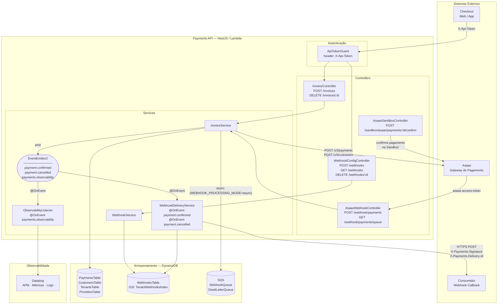

# Architecture Overview — Payments API

> Update whenever there is a structural change: new module, route, external
> dependency, database table or event topic. See rule in `AGENTS.md`.
>
> Last update: 2026-07-03

## Component Diagram

## Structural Changes Requiring Updates to This Diagram

| Type of Change | Examples |
| --- | --- |
| New NestJS Module | `WebhooksModule`, `NotificationsModule` |
| New route or route group | `GET /invoices/:id`, `POST /refunds` |
| New external dependency | New gateway, Notification Service, antifraud |
| New DynamoDB table or index | `NotificationsTable`, new GSI on `PaymentsTable` |
| New event topic or queue | `payment.refunded`, new SQS queue |
| Authentication change in a route | Add/remove guard in controller |

**Does not** require updates: new DTO fields, bugfixes within an existing service, new BDD scenarios without new infrastructure, internal refactors without contract changes.

## Structural Change History

| Date | Change |
| --- | --- |
| 2026-07-03 | Initial diagram creation. Modules: `InvoicesModule`, `AuthModule`, `WebhooksModule`, `ObservabilityModule`. Tables: `PaymentsTable`, `CustomersTable`, `TenantsTable`, `ProvidersTable`, `WebhooksTable`. |
