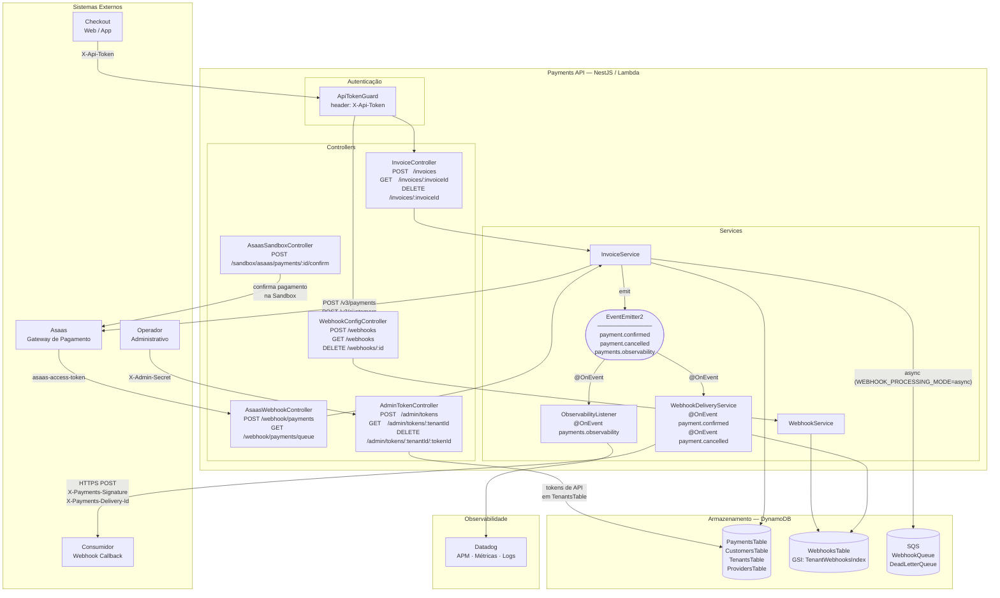

# Architecture Overview — Payments API

> Atualizar sempre que houver mudança estrutural: novo módulo, rota, dependência
> externa, tabela de banco ou tópico de evento. Ver regra em `AGENTS.md`.
>
> Última atualização: 2026-07-12

## Fronteira de responsabilidade

Payments API é o System of Record do domínio de pagamentos deste produto. Checkout e outros consumidores usam o contrato interno da Payments API; Asaas atua como PSP externo por meio de um adaptador de integração.

```text
Checkout / consumidores
        |
        | contrato interno
        v
Payments API / Payments SOR
        |
        | contrato do provedor
        v
Asaas / outros PSPs
```

Payments é responsável por `invoiceId`, associação com `orderId`, tenant e cliente, seleção do provedor, idempotência, estado interno e histórico de transições. O PSP é responsável pela execução externa da cobrança e por seus identificadores e eventos. Status externos são normalizados pela Payments API; não devem ser expostos como a verdade operacional do produto.

Esta fronteira é uma decisão de produto e arquitetura. Os estados e eventos efetivamente suportados continuam definidos pelos OBCs, BDD Features, Event Storming e código vigentes; este documento não promove comportamento novo para Downstream.

## Diagrama de componentes



## Mudanças estruturais que exigem atualização deste diagrama

| Tipo de mudança | Exemplos |
| --- | --- |
| Novo módulo NestJS | `WebhooksModule`, `NotificationsModule` |
| Nova rota ou grupo de rotas | `GET /invoices/:id`, `POST /refunds` |
| Nova dependência externa | Novo gateway, Notification Service, antifraude |
| Nova tabela ou índice DynamoDB | `NotificationsTable`, novo GSI em `PaymentsTable` |
| Novo tópico de evento ou fila | `payment.refunded`, nova fila SQS |
| Mudança de autenticação em rota | Adicionar/remover guard em controller |

**Não** exige atualização: novos campos em DTOs, bugfixes dentro de um serviço
existente, novos cenários BDD sem nova infra, refatorações internas sem mudança
de contrato.

## Histórico de mudanças estruturais

| Data | Mudança |
| --- | --- |
| 2026-07-03 | Criação inicial do diagrama. Módulos: `InvoicesModule`, `AuthModule`, `WebhooksModule`, `ObservabilityModule`. Tabelas: `PaymentsTable`, `CustomersTable`, `TenantsTable`, `ProvidersTable`, `WebhooksTable`. |
| 2026-07-11 | Adicionados `AdminTokenController` (`POST /admin/tokens`, `GET /admin/tokens/:tenantId`, `DELETE /admin/tokens/:tenantId/:tokenId`, autenticação via header `X-Admin-Secret`, tokens persistidos em `TenantsTable`) e a rota `GET /invoices/:invoiceId` no `InvoiceController`. |
| 2026-07-12 | Consolidada a fronteira Payments SOR ↔ PSP que antes estava duplicada em `docs/`; nenhum contrato de runtime foi alterado. |
